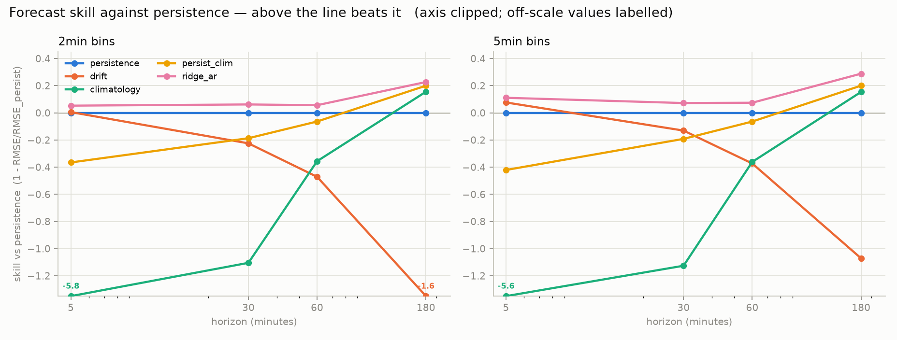
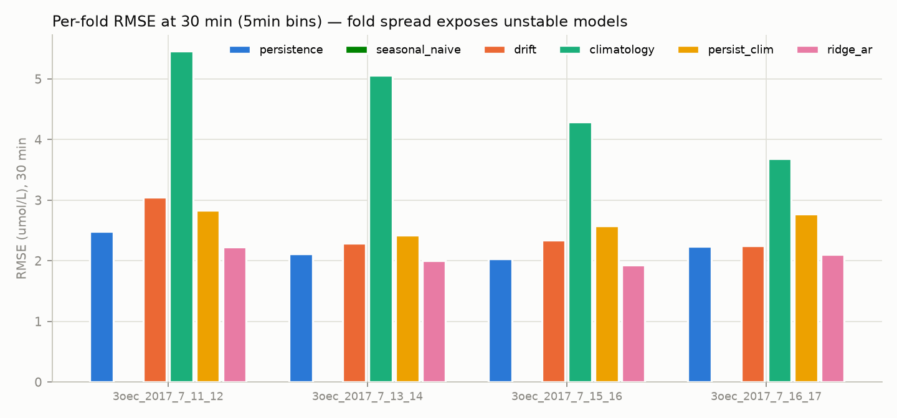
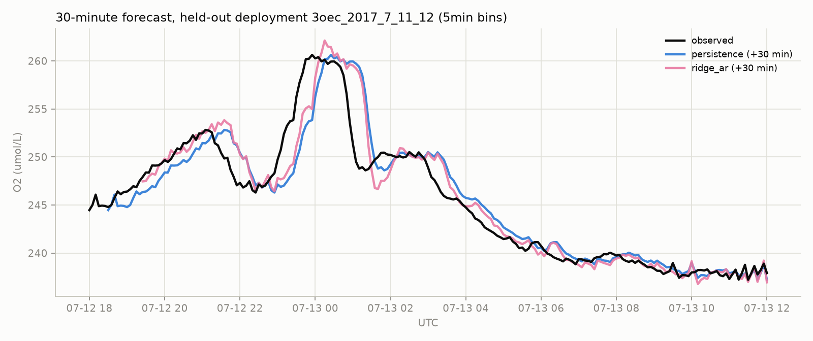
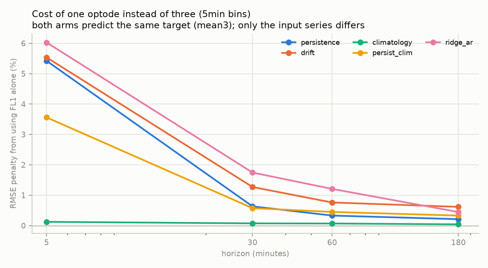
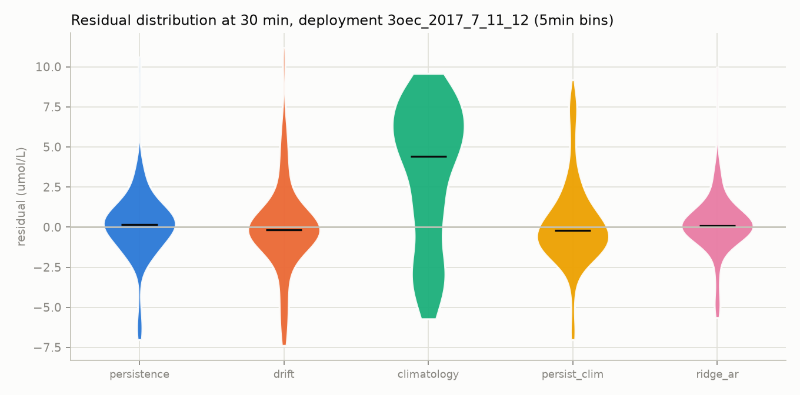

# Florida Keys: absolute forecast baselines

Target **O2 in µmol/L** (`do_native_value`), 3OEC deployment, 11–17 July 2017. Leave-one-deployment-out CV, 4 folds. Reproduce with `python -m smores.models.baselines` (~3 min); all settings are constants at the top of `src/smores/models/baselines.py`.

**How to read this.** **Finding** = measured here, with the table behind it named. **Hypothesis** = a possible explanation this data cannot confirm.

---

## 1. Why this exists

`data/corr_results/REPORT.md` ranks features by `mean_gain_pct` — "average RMSE change vs the DO-only AR model" — but never reports that model's RMSE. A −5.04% gain against an unknown baseline is uninterpretable: 5% off a useless model is still useless. `data/eda/REPORT.md` §10 likewise asserts that persistence is a strong baseline a model must beat, without building one.

This report supplies the missing absolute numbers, on the same grid (5 min), the same AR window (12 steps) and the same CV scheme (leave-one-deployment-piece-out) so the two are directly comparable.

| | |
|---|---|
| Deployments | 18.0 h, 19.0 h, 20.0 h, 14.0 h (169–241 bins each at 5 min) |
| Deployment mean O2 | 245.5, 244.9, 253.0, 258.1 µmol/L — a real level drift across the week |
| Grids | 5 min (matches `corr_results`), 2 min (the `test_sampling_frequency.py` winner) |
| Horizons | 5, 30, 60, 180 min |
| Noise floor | inter-optode SD **0.163 µmol/L** at 5 min, 0.192 at 2 min |

---

## 2. The baseline table

5-min bins, three-sensor-mean input, pooled across folds. Full numbers including the 2-min grid in [results.csv](results.csv); per-fold in [results_per_fold.csv](results_per_fold.csv).

| model | RMSE 5 min | 30 min | 60 min | 180 min |
|---|---|---|---|---|
| **ridge_ar** | **0.604** | **2.060** | **3.356** | **4.480** |
| drift | 0.627 | 2.510 | 4.978 | 13.046 |
| persistence | 0.679 | 2.220 | 3.626 | 6.297 |
| persist_clim | 0.965 | 2.645 | 3.858 | 5.036 |
| climatology | 4.509 | 4.719 | 4.936 | 5.326 |

Skill vs persistence (`1 − RMSE/RMSE_persist`; positive beats it), with folds-beating-persistence out of 4:

| model | 5 min | 30 min | 60 min | 180 min |
|---|---|---|---|---|
| **ridge_ar** | **+0.111** (4/4) | **+0.072** (4/4) | **+0.074** (4/4) | **+0.289** (4/4) |
| persist_clim | −0.421 (0/4) | −0.192 (0/4) | −0.064 (1/4) | +0.200 (3/4) |
| climatology | −5.640 (0/4) | −1.126 (0/4) | −0.361 (0/4) | +0.154 (4/4) |
| drift | +0.076 (3/4) | −0.131 (0/4) | −0.373 (0/4) | −1.072 (0/4) |

Same results in **MARE** — the metric defined by **Raman Zatsarenko** ([github.com/rzv09](https://github.com/rzv09)) in `src/metrics/np/regression.py` of [rzv09/smores_proj](https://github.com/rzv09/smores_proj) and reported across 32 of that repo's files. Reproduced here so these numbers drop into existing comparisons:

| model | 5 min | 30 min | 60 min | 180 min |
|---|---|---|---|---|
| **ridge_ar** | **0.0017** | **0.0060** | **0.0103** | **0.0139** |
| persistence | 0.0019 | 0.0064 | 0.0110 | 0.0212 |
| drift | 0.0018 | 0.0074 | 0.0144 | 0.0396 |
| persist_clim | 0.0024 | 0.0079 | 0.0115 | 0.0157 |
| climatology | 0.0152 | 0.0162 | 0.0172 | 0.0189 |

RMSE and MAE stay the primary scores: MARE is scale-dependent, so unlike the skill scores it *would* move if the open question about this site's absolute level were ever resolved.

*Implementation note:* this uses the corrected epsilon placement from `smores/from_smoresProj/metrics/np/regression.py` (`abs(truth) + eps`, not upstream's `abs(truth + eps)`, which is wrong-signed for negative truth). The two agree exactly on this dataset — O2 is ~250 µmol/L throughout — but would diverge on SMORES channels sitting at a negative pO2 floor.

### Prior work

The forecasting models this baseline is a reference for — LSTM single-step and multi-step, DeepAR, and the transfer-learning / federated-learning cross-region experiments — are the work of **Raman Zatsarenko** in [rzv09/smores_proj](https://github.com/rzv09/smores_proj). The Santa Barbara and 3OEC loaders in `src/data_processing/` are his, vendored verbatim and credited in their module headers.

That repo's only baseline is `rolling_average_model(test_seq, 12)` — a moving average used to overlay predictions on plots. The present report adds the absolute reference table those models can be scored against; it does not re-implement or supersede any of them.

**Findings**

- **Persistence RMSE runs 0.68 → 6.30 µmol/L from 5 min to 3 h.** That is the number `corr_results` was implicitly measuring against and never stated.
- **`ridge_ar` is the only model that beats persistence at every horizon, in every fold** (16/16). Its margin is modest and flat in the middle — 7–11% at 5–60 min — then jumps to 29% at 3 h, where persistence finally decays and diel structure starts paying.
- **Nothing else is stable.** `drift` helps at 5 min (3/4 folds) and is catastrophic at 3 h (RMSE 13.0, worse than persistence by 107%): extrapolating a 12-step slope 36 steps out is unphysical. `persist_clim` and `climatology` are *worse* than persistence at short horizons by construction — they discard information about the current value in exchange for diel shape, a trade that only pays past ~1 h.
- **A diel cycle is present and strong:** fitted climatology peaks at **19:00 EDT**, troughs at **05:00**, amplitude **17.2 µmol/L** against a 41 µmol/L total range. That independently reproduces the diel structure established in `notes/florida_keys_findings.md` §2.1 from the raw series.

The trace shows the mechanism: both persistence and `ridge_ar` trail the real peaks by roughly the horizon. Neither anticipates a turning point; they track and lag.

---

## 3. What this does to the feature ranking

**Finding.** `corr_results`' best feature, `Vx`, claims a 5.04% RMSE gain. Converted against the baselines above:

| horizon | ridge_ar RMSE | 5.04% of it | inter-optode noise floor |
|---|---|---|---|
| 5 min | 0.604 | **0.030** | 0.163 |
| 30 min | 2.060 | **0.104** | 0.163 |
| 60 min | 3.356 | **0.169** | 0.163 |

At 5 and 30 minutes the entire claimed benefit of the best-ranked feature is **smaller than the disagreement between three optodes measuring the same water**; at 60 minutes it is about equal to it. The gain is not distinguishable from instrument noise at this sample size and is not operationally meaningful.

*Caveat on the comparison:* `corr_results`' AR baseline is DO-history-only, while `ridge_ar` here adds hour-of-day sin/cos. Its true baseline therefore sits somewhere between this report's `persistence` and `ridge_ar`, which narrows the arithmetic above only slightly — the conclusion holds across that whole range. An RMSE *reduction* below the noise floor is still a reduction in principle; the claim here is that it cannot be resolved from four 18-hour pieces.

**A second reason to discount that ranking.** `feature_correlation_analysis.py:504` sets `--max-lag` to 36 steps. Four of the ten features in the FL table — `Vx`, `O2_spread`, `Vz` (all at +36) and `hour_cos` (−36) — peak **exactly on the boundary of the lag search window**. A peak pinned to the edge of its own search range is the signature of no interior peak at all, not of a 3-hour lead. `Vx` additionally carries `sign_consistent: False`. **(finding, on the configuration; hypothesis as to cause)**

---

## 4. Does averaging three optodes buy forecast skill?

Merikhi et al. (2021) prove the three-sensor mean equals the O2 concentration at the centre of the ADV measuring volume, and report that averaging cuts signal variance 1.9–3.4×. They only ever evaluate that for **flux**. Whether it helps **forecasting** is open.

Both arms predict the same target (`mean3`); only the input series differs. Scoring a single sensor against *itself* would hand the averaged arm a free win, because its target would be the smoother of the two series.

RMSE penalty from using one optode instead of three (5 min):

| model | 5 min | 30 min | 60 min | 180 min |
|---|---|---|---|---|
| ridge_ar | **+6.03%** | +1.75% | +1.21% | +0.45% |
| drift | +5.53% | +1.27% | +0.76% | +0.62% |
| persistence | +5.42% | +0.63% | +0.33% | +0.21% |
| persist_clim | +3.56% | +0.57% | +0.45% | +0.33% |
| *climatology (control)* | *+0.12%* | *+0.07%* | *+0.07%* | *+0.04%* |

**Finding: the three-sensor mean helps, but only at short horizons.** The penalty for a single optode is 5–6% at 5 minutes and decays to 0.2–0.6% at 3 hours.

**Hypothesis for the shape:** averaging suppresses sensor noise, and sensor noise only matters while it is a meaningful share of total forecast error. At 5 minutes the error (0.60 µmol/L) is within a factor of four of the noise floor (0.163), so a cleaner input measurably helps. At 3 hours the error (4.48) is dominated by genuine unpredictability, and cleaning the input buys nothing.

**Internal control:** `climatology` barely uses the input series — only an expanding mean — and its penalty is 0.04–0.12%, i.e. ~0. That it sits flat at zero while the input-dependent models show a real effect is evidence the comparison is measuring what it claims to.

---

## 5. Two things that cannot be done on this dataset

**Finding: seasonal naive is unevaluable here.** `y(t+h) = y(t+h−24h)` requires `t−24h` inside the same deployment. The deployments are 14–20 h long, so there are **zero** valid samples at any horizon, in any fold. It is implemented and scored in `baselines.py` so the gap is measured rather than assumed; it contributes 0 rows to `results.csv`.

**Finding: horizons beyond ~3 h are unevaluable.** The 6/12/24 h horizons in `eda/REPORT.md` §10 are meaningful for the 5-week Biscayne record but have no valid samples on 14–20 h pieces.

**Finding: there is no complete diel cycle anywhere in this dataset.** Hour-of-day coverage across the four deployments:

| local hour | 0–5, 16–23 | 11–13 | 14–15 | 7, 8, 10 | 9 |
|---|---|---|---|---|---|
| deployments covering | 4 | 2 | 3 | **1** | **0** |

This is four overlapping partial days, not four days. The climatology is fitted on the 20 of 24 hours that clear both gates (≥10 samples **and** ≥2 contributing deployments).

> **A trap worth recording.** With a sample-count filter alone, hour 10 passed on a *single* deployment's 12 samples, and the fitted climatology put its trough at **10:00** — contradicting the 06:00–07:00 trough visible in the raw series. Adding the ≥2-deployment gate moved the trough to **05:00**, consistent with the raw data and with the expected pre-dawn respiration minimum. One deployment's local level was masquerading as a diel feature. `notes/florida_keys_findings.md` §6 flagged the sample-count version of this hazard; the deployment-count version is the one that actually bites.

---

## 6. Limitations

- **Four folds, ~18 h each, one site, one week.** Tiny. Every number here carries that.
- **No hypoxia in this dataset.** O2 stays in 230–271 µmol/L, a ±3.2% swing, never near the 2 mg/L threshold. These baselines establish short-horizon skill on a near-stationary signal and say **nothing** about event detection or early warning. A model that does well here has not been shown to do anything useful at Biscayne Bay.
- **Target is µmol/L as published.** The open question about this site's absolute saturation level is parked and does not touch these results: skill scores and percentage RMSE gains are invariant to any constant rescaling of the target.
- **`ridge_ar` is not tuned.** `alpha=1.0`, 12 lags, no feature selection. It is a baseline, not a proposal.
- **No temperature record exists** for this deployment, so no thermal covariate was available.

---

## 7. What this implies for the modelling work

- **Report absolute RMSE alongside any percentage gain.** The `corr_results` ranking survives as a *relative* ordering but cannot establish that any feature matters, because its reference was never stated.
- **Quote the noise floor with every result.** 0.163 µmol/L at 5 min is the floor on this instrument; improvements below it are not resolvable from this much data.
- **Persistence is the bar at short horizons and it is high.** Only a regularised AR cleared it consistently, and only by 7–11% out to an hour.
- **Diel structure pays only past ~1 h.** Below that it actively hurts. Any model that leans on time-of-day features at short horizons should be checked against plain persistence first.
- **Use the three-sensor mean as model input**, not a single optode — worth 5–6% at short horizons, free to compute.
- **The 24-h-scale questions need the Biscayne record.** Seasonal naive, ACF/PSD at diel scale, and 6–24 h horizons are all unevaluable on 14–20 h pieces. `data/raw/biscayne_bay/` currently holds only a `.gitkeep`.

---

*Produced with `src/smores/models/baselines.py`. Figures in `figures/`, numbers in `results.csv` and `results_per_fold.csv`. Guarded by `tests/test_baselines.py`. No raw or processed data was modified.*
